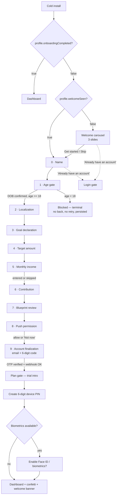

# Piggy — Onboarding Flow Reference

> **Audience:** an AI model (or engineer) rebuilding this onboarding flow on another
> platform — most likely a marketing website or web app — without access to this
> codebase.
>
> **Goal of this document:** enough detail to reproduce the flow *one-to-one*: every
> screen, in order, with its exact copy, exact layout, exact validation rules, exact
> state transitions, exact maths, and exact visual tokens.
>
> **Source of truth:** this document was written by reading the shipped implementation
> (`app/onboarding.tsx`, `app/welcome.tsx`, `src/components/**`, `src/lib/**`,
> `src/lib/i18n/locales/en/*.json`, `global.css`, `tailwind.config.js`) on
> 2026-09-04. Where the document states a number, that number is from the code, not
> an estimate.

---

## Table of contents

1. [What Piggy is, and what onboarding has to achieve](#1-what-piggy-is-and-what-onboarding-has-to-achieve)
2. [Flow map](#2-flow-map)
3. [Design system](#3-design-system)
4. [Shared components](#4-shared-components)
5. [The onboarding shell (chrome shared by every step)](#5-the-onboarding-shell-chrome-shared-by-every-step)
6. [Screen-by-screen specification](#6-screen-by-screen-specification)
7. [State model and persistence](#7-state-model-and-persistence)
8. [Business logic and formulas](#8-business-logic-and-formulas)
9. [Account creation and the backend contract](#9-account-creation-and-the-backend-contract)
10. [Post-onboarding handoff](#10-post-onboarding-handoff)
11. [Ordering rationale — why the steps sit where they do](#11-ordering-rationale--why-the-steps-sit-where-they-do)
12. [Failure and edge-case matrix](#12-failure-and-edge-case-matrix)
13. [Internationalisation](#13-internationalisation)
14. [Porting notes for the web](#14-porting-notes-for-the-web)
15. [Appendix A — full English copy (verbatim)](#appendix-a--full-english-copy-verbatim)
16. [Appendix B — NativeWind → CSS conversion table](#appendix-b--nativewind--css-conversion-table)

---

## 1. What Piggy is, and what onboarding has to achieve

Piggy is a goal-based savings coach. The user names one savings goal, says how much
it costs, says what they can set aside monthly, and Piggy turns that into a dated plan
with streaks, missions and an AI coach on top.

The defining product constraint — and the thing the onboarding copy leans on hardest —
is that **Piggy never connects to a bank account**. There is no Plaid step, no
credential prompt, nothing to link. Competing apps have to *promise* safety; Piggy's
safety is structural. Two separate screens (welcome slide 2, and the reassurance block
above the email field) exist purely to say this.

Onboarding must, in order:

1. Sell the product before asking for anything (3-slide carousel).
2. Collect a first name.
3. Enforce an 18+ age gate (legal requirement, terminal if failed).
4. Establish country / currency / language.
5. Capture the goal, its cost, the user's income, and their monthly contribution.
6. Show the derived plan back to them ("blueprint") as the payoff.
7. Ask for push-notification permission while the payoff is still on screen.
8. Only *then* ask for an email, and create the account via a 6-digit email code.
9. Hand off to: trial intro → device PIN creation → dashboard (with confetti).

No account exists until step 8. Everything before it is local-only.

---

## 2. Flow map



**Step indices are meaningful.** The enum in code is:

| Index | Step | Progress label |
| ---: | :--- | :--- |
| 0 | `Name` | Step 1 of 10 |
| 1 | `AgeGate` | Step 2 of 10 |
| 2 | `Localization` | Step 3 of 10 |
| 3 | `GoalDeclaration` | Step 4 of 10 |
| 4 | `TargetAmount` | Step 5 of 10 |
| 5 | `Income` | Step 6 of 10 |
| 6 | `Contribution` | Step 7 of 10 |
| 7 | `BlueprintReview` | Step 8 of 10 |
| 8 | `PushPermission` | Step 9 of 10 |
| 9 | `AccountFinalization` | Step 10 of 10 |

`TOTAL_STEPS` is derived as `AccountFinalization + 1 = 10`, never hardcoded. There is
**no success screen** inside onboarding — it hands straight off to the plan gate.

---

## 3. Design system

### 3.1 Stack facts (and what they mean for a web port)

| Fact | Consequence for a web rebuild |
| :--- | :--- |
| React Native + Expo Router, NativeWind (Tailwind for RN) | Class names are Tailwind's, so they port almost verbatim to a web Tailwind setup. See [Appendix B](#appendix-b--nativewind--css-conversion-table). |
| **No dark mode anywhere.** `global.css` defines one `:root` palette; no `.dark`, no `useColorScheme`. | Build light-only, or treat dark as new design work. |
| Fonts: Nunito 400 / 600 / 700 / 800 (Google Fonts) | `font-black` (weight 900) has no 900 face loaded — it renders as **Nunito 800 ExtraBold**. On the web, map `font-black` → Nunito 800 for visual parity. |
| Icons: two systems. `lucide-react-native` line icons (hardcoded hex colors) + 29 custom full-colour PNG illustrations (`Icon` component, no tint) | Lucide has an identical web package. The PNG illustrations are bespoke art — substitute or re-export. |
| Motion: `react-native-reanimated` springs; haptics via `expo-haptics` | Springs port to Framer Motion / Motion for React. **Haptics have no web equivalent** — drop them. |

### 3.2 Color tokens

Defined as HSL triples in `global.css`, consumed through Tailwind as `hsl(var(--token))`.
Hex values below are computed from those triples.

| Token | HSL | Hex | Tailwind class | Role |
| :--- | :--- | :--- | :--- | :--- |
| `--primary` | `224 76% 48%` | `#1D4FD7` | `bg-primary` / `text-primary` | Brand, primary CTA, active states |
| `--primary-foreground` | `0 0% 100%` | `#FFFFFF` | `text-primary-foreground` | Text on primary |
| `--primary-container` | `214 95% 93%` | `#DCEBFE` | `bg-primary-container` | Selected chips, tonal fills |
| `--on-primary-container` | `222 47% 20%` | `#1B294B` | `text-on-primary-container` | Text on primary-container |
| `--secondary` | `217 91% 60%` | `#3C83F6` | `bg-secondary` | Secondary actions |
| `--secondary-container` | `214 80% 92%` | `#DAE8FB` | `bg-secondary-container` | Secondary tonal surfaces |
| `--on-secondary-container` | `217 50% 25%` | `#203860` | | |
| `--tertiary` | `142 71% 45%` | `#21C45D` | `bg-tertiary` | Accent green |
| `--tertiary-container` | `142 80% 92%` | `#DAFBE6` | | |
| `--on-tertiary-container` | `142 60% 18%` | `#124927` | | |
| `--background` | `210 40% 98%` | `#F8FAFC` | `bg-background` | App background |
| `--surface` | `0 0% 100%` | `#FFFFFF` | `bg-surface` | Screen background in onboarding |
| `--surface-dim` | `220 20% 94%` | `#EDEFF3` | | |
| `--surface-container-lowest` | `0 0% 100%` | `#FFFFFF` | | |
| `--surface-container-low` | `210 40% 96%` | `#F1F5F9` | `bg-surface-container-low` | Input fills, default card fill |
| `--surface-container` | `210 40% 94%` | `#EAF0F6` | `bg-surface-container` | Info/reassurance blocks, progress track |
| `--surface-container-high` | `210 40% 91%` | `#DFE8F1` | | Wheel-picker selection band, icon buttons |
| `--surface-container-highest` | `210 40% 88%` | `#D4E0ED` | | Pressed state of the above |
| `--on-surface` | `222 47% 11%` | `#0F1729` | `text-on-surface` | Primary text |
| `--on-surface-variant` | `215 16% 47%` | `#65758B` | `text-on-surface-variant` | Secondary / muted text |
| `--outline` | `214 32% 84%` | `#C9D4E3` | `border-outline` | Borders on interactive rows |
| `--outline-variant` | `214 32% 90%` | `#DDE4EE` | `border-outline-variant` | Input borders, dividers |
| `--destructive` | `0 74% 42%` | `#BA1C1C` | `text-destructive` | Field errors, error panels |
| `--warning` | `38 92% 50%` | `#F59F0A` | `text-warning` | Warning text |
| `--warning-container` | `38 100% 93%` | `#FFF2DB` | `bg-warning-container` | Warning panel background |
| `--success` | `142 71% 45%` | `#21C45D` | | |
| `--progress` | `142 71% 45%` | `#21C45D` | | |
| `--progress-light` | `142 60% 58%` | `#54D483` | | |
| `--progress-subtle` | `142 75% 85%` | `#BCF5D1` | | |
| `--radius` | | `20px` | *(declared but unused)* | |

**Hardcoded hex used inline by icons** (these bypass the token system in the real code —
reproduce them literally):

| Hex | Where |
| :--- | :--- |
| `#1D4ED8` | `ShieldCheck` icons, back-arrow glyphs, calendar accents, `ActivityIndicator` on light backgrounds |
| `#64748B` | `ChevronDown` glyphs on picker rows |
| `#94A3B8` | `PLACEHOLDER_COLOR` — every text input's placeholder |
| `#92400E` | `AlertTriangle` glyph inside warning panels |
| `#475569` | `X` close glyph in sheet headers |
| `#22C55E` | `Check` glyph on the selected picker row |
| `#ffffff` | Right-arrow glyph inside primary buttons |
| `#CBD5E1` | Bottom-sheet drag handle |

> Note `#1D4ED8` (icons) vs `#1D4FD7` (the `--primary` token). They differ by one step
> of rounding; the codebase uses both. Reproduce as-is or unify to `#1D4ED8`.

### 3.3 Typography

| Role | Classes | Computed |
| :--- | :--- | :--- |
| Carousel headline | `text-4xl font-black text-center` | 36px / 40px line-height, weight 900→Nunito 800 |
| Carousel sub | `text-base font-medium leading-6 text-center` | 16px / 24px, weight 500 |
| Onboarding step headline | `text-3xl font-black` | 30px / 36px |
| Onboarding step sub | `text-sm font-medium` | 14px / 20px |
| Terminal (blocked) title | `text-2xl font-black text-center` | 24px / 32px |
| Field label | `text-xs font-semibold` | 12px / 16px, weight 600 |
| Input text | `text-base font-medium` | 16px |
| Currency input text | `text-xl font-bold` | 20px, weight 700 |
| OTP code input | `text-3xl font-bold tracking-[12px] text-center` | 30px, 12px letter-spacing |
| Primary button label | `text-base font-bold` (`text-sm` on mid-flow steps) | 16px / 14px, weight 700 |
| Field error | `text-xs text-destructive` | 12px |
| Legal / footnote | `text-xs leading-5` | 12px / 20px |
| Progress counter | `text-xs font-semibold text-center` | 12px |

### 3.4 Shape, spacing, elevation

- **Radii:** cards/inputs/panels `rounded-2xl` (16px); hero cards (blueprint) `rounded-3xl`
  (24px); buttons, chips, pills, dots `rounded-full`; bottom sheets `borderTopRadius: 32`
  (hardcoded, not a class).
- **Screen padding:** `px-5` (20px) horizontally everywhere in onboarding; the carousel
  uses `px-8` (32px) for slide content.
- **Vertical rhythm:** headline `mb-2` (8px) → sub `mb-6`/`mb-8` (24/32px) → content.
- **Card shadow** (blueprint card, and the app-wide convention — inline style, never a
  Tailwind `shadow-*` class):
  ```js
  { shadowColor: '#000', shadowOffset: { width: 0, height: 2 },
    shadowOpacity: 0.07, shadowRadius: 8, elevation: 4 }
  ```
  Web equivalent: `box-shadow: 0 2px 8px rgba(0,0,0,0.07);`
- **Sheet shadow:**
  ```js
  { shadowColor: '#000', shadowOffset: { width: 0, height: -10 },
    shadowOpacity: 0.1, shadowRadius: 20, elevation: 25 }
  ```
  Web equivalent: `box-shadow: 0 -10px 20px rgba(0,0,0,0.1);`
- **Buttons never use shadows.** Depth is a flat 3–4px darker bottom border plus a
  press-driven `translateY` — see §4.1.

### 3.5 Motion presets

```js
springPresets.press    = { damping: 15, stiffness: 300 }                          // taps
springPresets.sheet    = { damping: 30, stiffness: 200, overshootClamping: true } // sheet snap
springPresets.entrance = { damping: 16, stiffness: 160 }                          // staggered entrance
timingPresets.sheet    = { duration: 280, easing: Easing.inOut(Easing.cubic) }    // programmatic sheet open/close
timingPresets.segment  = { duration: 200, easing: Easing.out(Easing.cubic) }
```

**Rule of thumb used throughout:** springs for anything interactive or gesture-driven,
`withTiming` only for non-interruptible programmatic transitions.

Every onboarding step's content enters with Reanimated's `FadeInDown.springify()` —
a downward-origin fade-and-slide on a default spring. Reproduce on the web as roughly
`opacity 0→1, translateY -16px→0`, spring-ish, ~300ms.

### 3.6 Haptics (native only — no web equivalent)

| Trigger | Haptic |
| :--- | :--- |
| Any `Button` / `PressableScale` release | `selectionAsync()` |
| Wheel-picker column crossing an item | `selectionAsync()` |
| Picker row selection, sheet snap, calendar day tap | `impactAsync(Light)` |
| PIN entry error | `notificationAsync(Error)` |
| Calendar confirm | `notificationAsync(Success)` |

---

## 4. Shared components

### 4.1 `Button`

`cva`-based, the only variant-driven primitive in the app.

- **Base:** `flex-row items-center justify-center gap-2 rounded-full disabled:opacity-50`
- **Variants:** `default` (`bg-primary`) · `destructive` (`bg-destructive`) · `outline`
  (`border border-outline bg-transparent`) · `secondary` · `ghost` · `link` · `tonal`
  (`bg-primary-container`) · `chip` (`border-2 border-primary bg-primary-container`)
- **Sizes:** `default` `h-12 px-6 py-3` · `sm` `h-10 px-4` · `lg` `h-14 px-8` · `icon`
  `h-12 w-12` · `chip` `px-5 py-3`
- **Per-variant bottom border ("3D" depth):**
  | Variant | Border |
  | :--- | :--- |
  | `default` | `border-bottom: 4px solid #1E3A8A` |
  | `destructive` | `border-bottom: 4px solid #7F1D1D` |
  | `tonal` | `border-bottom: 4px solid #166534` |
  | `chip` | `border-bottom: 3px solid #1E3A8A` |
  | `outline` / `ghost` / `link` / `secondary` | none |
- **Press animation:** `scale 1 → 0.97` and `translateY 0 → 3px`, `springPresets.press`,
  released on gesture finalize. This is what sells the "button sinking into its own
  bottom border" effect — implement both halves or it looks wrong.
- **Accessibility:** always `accessibilityRole="button"`; an icon-only button with no
  `label` and no `accessibilityLabel` logs a dev warning.

Onboarding uses `h-14` (56px) explicitly on the first/last steps' buttons and default
height in the middle; the back button is a `variant="outline"` square `w-14` with only
a `<ArrowLeft size={16} color="#1D4ED8" />` inside and `accessibilityLabel` = "Back".

### 4.2 `Input`

One primitive, no variants:

```
h-14 w-full rounded-2xl border border-outline-variant bg-surface-container-low
px-4 py-3 text-base font-medium text-on-surface
```
Placeholder colour `#94A3B8`; text vertically centred (`verticalAlign: middle`).

### 4.3 `CurrencyAmountInput`

A row, not a bare input — used by the target-amount, income and contribution steps.

```
flex-row items-center rounded-2xl bg-surface-container-low border border-outline-variant px-4 h-14
```
- Currency symbol rendered as `text-xl font-bold text-on-surface-variant`, placed
  **before** the field (`mr-2`) or **after** it (`ml-2`) according to the currency's
  `symbolAfter` flag. PLN (`zł`), SEK/NOK/DKK (`kr`) and HUF (`Ft`) are `symbolAfter: true`;
  everything else is `false`.
- Input itself: `flex-1 text-xl font-bold text-on-surface`, `keyboardType="numeric"`.
- **Sanitisation on every keystroke:** `value.replace(/[^0-9.]/g, '')`. Digits and dots
  only; no thousands separators while typing; no clamping.

### 4.4 `BottomSheet`

Wraps the country/currency/language pickers, the DOB confirmation, and the calendar.

- Renders in a native modal; backdrop `#000` fading `0 → 0.4` opacity, driven by the
  same shared value as the sheet's `translateY`.
- Sheet: white, `borderTopLeftRadius/RightRadius: 32`, sheet shadow (§3.4), bottom
  padding `max(safeAreaBottom, 20)`, height content-driven and capped at 90% of the
  window.
- Drag handle: `40 × 4px`, `borderRadius 2`, `#CBD5E1`, inside a `paddingVertical: 10`
  hit zone.
- Drag tracks the finger 1:1; on release, closes if `velocityY > 500` **or**
  `translateY > sheetHeight / 3`, otherwise snaps back. Snap uses `springPresets.sheet`
  with the gesture velocity injected; programmatic open/close uses `timingPresets.sheet`.
- Backdrop is tap-to-dismiss but hidden from screen readers (each sheet supplies its own
  labelled close control).

### 4.5 `PickerModal`

Searchable list inside a `BottomSheet`. Used for country, currency and language.

- Header: `p-5`, bottom border `outline-variant`, title `text-xl font-bold`, and a
  40×40 round close button (`bg-surface-container-high`, `X` glyph `#475569`,
  `accessibilityLabel` = "Close").
- Search field: standard `Input`, placeholder `"Search..."`, `autoCapitalize="none"`.
  Filter matches **either** the display name or the code, case-insensitively.
- List: fixed `height: 360`, virtualised, 1px `outline-variant/40` separators inset by
  `mx-5`.
- Row: `flex-row items-center justify-between px-5 py-4`. Optional symbol in a `w-8`
  centred `text-base font-bold text-on-surface-variant` cell, then name
  (`text-base font-medium`) over code (`text-xs text-on-surface-variant`). Selected row
  shows a `Check` glyph `#22C55E` on the right.
- Selecting fires a Light haptic, clears the search, and closes.

### 4.6 `DobWheelPicker`

Three-column inline wheel (day · month · year) — **not** a modal.

- Item height 44px, 5 visible items ⇒ wheel height 220px, vertical padding 88px.
- Selection band: absolutely positioned, `top: 88, height: 44`, `rounded-2xl`,
  `bg-surface-container-high`, `pointerEvents: none`.
- Snap: `snapToInterval = 44`, `decelerationRate="fast"`; the selected index is
  `round(contentOffset.y / 44)` on momentum end, with a selection haptic on change.
- Selected item: `text-lg font-black text-on-surface`. Unselected:
  `text-base font-medium text-on-surface-variant/50`.
- Column data: days 1…`daysInMonth(year, month)`; months 1–12 rendered as
  `Jan Feb Mar Apr May Jun Jul Aug Sep Oct Nov Dec` (**hardcoded English, not
  translated**); years `currentYear-99 … currentYear` (100 entries, ascending).
- Day is clamped when the month/year change shrinks the month (e.g. 31 Jan → Feb ⇒ 28/29).
- Emits `yyyy-MM-dd`.

### 4.7 `DobConfirmModal`

`BottomSheet` containing:
- Title `text-xl font-bold text-center` — **"Is this correct?"**
- Body `text-sm text-on-surface-variant text-center` — **"Once confirmed, this can't be changed."**
- The date, `mt-4 text-2xl font-black text-primary text-center`, formatted as
  `{ month: 'long', day: 'numeric', year: 'numeric' }` in the app's language
  (e.g. "January 1, 2001").
- Two `h-14 flex-1` buttons in a row with `gap-3`: `outline` **"Edit"** and default
  **"Confirm"**.
- Dismissing the sheet by drag/backdrop is equivalent to **Edit** (it calls `onEdit`).

### 4.8 `CalendarModal`

Only reachable from the contribution step's *fixed-deadline* mode.
- Header (`p-5`, bottom border): title **"Target Date"** (`text-xl font-bold`), subtitle
  **"When do you want to reach your goal?"** (`text-sm text-on-surface-variant`), round
  close button as in §4.5.
- Quick-jump pills row: **`+6mo` `+1yr` `+2yr` `+5yr`** — `rounded-full
  bg-surface-container-high px-4 py-2`, label `text-sm font-semibold text-primary`. Each
  sets the selection to `today + N months`.
- Month grid: tapping the calendar header opens a year strip (horizontal, `currentYear-2`
  → `currentYear+38`, 41 entries) over a 4-column month grid (`w-[23%]`, `rounded-xl`,
  `py-3`); the selected pill is `bg-primary` with white text.
- Calendar theme: selected day `#1D4ED8` on white text; today `#1D4ED8`; day text
  `#1e293b`; disabled `#94a3b8`; header/arrows `#1D4ED8`; day font 16px/400, month
  18px/700, weekday header 12px/600.
- Footer: `outline` **"Cancel"** and default **"Confirm"**, both `flex-1 h-14`.

### 4.9 `Mascot`

`expo-image` PNG, `contentFit: contain`, square. Expressions: `idle` | `happy` |
`thinking` | `celebrating`; only `celebrating` currently has its own asset, everything
else falls back to the default waving pose. Switching *to* `celebrating` plays
`scale 1 → 1.25 → 1` on `springPresets.press`.

Sizes in this flow: **160** (carousel), **64** (name step; account step, celebrating),
**120** (trial intro, celebrating), **48** (PIN screens).

### 4.10 `Icon`

Renders one of 29 full-colour PNG illustrations by name; no `color` prop (they are
multi-colour art and cannot be tinted). Names used in this flow: `padlock`, `bell`,
`flame`, `target`, `airplane`, `car`, `house`, `shield-check`, `pencil`.

### 4.11 `PressableScale`

The canonical tap primitive for chips/rows: `scale 1 → 0.96` on `springPresets.press`
plus a selection haptic. Used for the goal chips.

### 4.12 `AnimatedProgressBar`

The app's general-purpose continuous progress bar. **Onboarding imports it but does not
render it** — the step header uses the segmented `ProgressSegment` instead (§5). It is
documented here because it is the component a porter will otherwise reach for when
building anything progress-shaped in this design language, and because it is the shape
every *other* progress bar in the app takes (dashboard XP bar, goal completion bars,
mission progress).

```ts
interface AnimatedProgressBarProps {
  progress: number;               // 0–1
  height?: number;                // default 8
  color?: string;                 // default '#22C55E'
  trackStyle?: StyleProp<ViewStyle>;
  duration?: number;              // default 500 (ms)
}
```

**Structure** — a track with a full-width fill inside it, scaled horizontally:

| Layer | Style |
| :--- | :--- |
| Track | `width: 100%`, `height`, `borderRadius: height / 2`, `overflow: hidden`, `backgroundColor: rgba(0,0,0,0.08)` (overridable via `trackStyle`) |
| Fill | `width: 100%`, `height`, `borderRadius: height / 2`, `backgroundColor: color`, `transformOrigin: 'left'`, `transform: [{ scaleX: progress }]` |

**Animation.** `withTiming(progress, { duration, easing: Easing.out(Easing.cubic) })` —
timing, not a spring, because this is non-interruptible decorative motion rather than
gesture handoff.

**Two details that matter if you reimplement it:**

- The fill is a **full-width element scaled by `scaleX`**, never an animated `width`.
  Animating `width` forces a layout re-measure every frame; `transform` does not. Web CSS
  has the same property: use `transform: scaleX()` with `transform-origin: left`, not an
  animated `width`.
- `scaleX` is floored at `0.0001`, never `0`. A true zero scale collapses the node and can
  render as an artefact rather than as an empty bar.

**Web equivalent**

```css
.track { width: 100%; height: 8px; border-radius: 4px;
         overflow: hidden; background: rgba(0,0,0,0.08); }
.fill  { width: 100%; height: 100%; border-radius: 4px; background: #22C55E;
         transform-origin: left; transform: scaleX(var(--progress));
         transition: transform 500ms cubic-bezier(0.33, 1, 0.68, 1); }
```

**How it differs from onboarding's `ProgressSegment`:**

| | `AnimatedProgressBar` | `ProgressSegment` (onboarding header) |
| :--- | :--- | :--- |
| Shape | One continuous bar | 10 discrete segments, `flex-1`, `gap-1` |
| Value | Fractional `0–1` | Binary per segment (`i <= step`) |
| Motion | `withTiming`, 500 ms, ease-out cubic | `withSpring`, `springPresets.press` |
| Height | 8px default | `h-2.5` (10px) |
| Colors | Fill `#22C55E`, track `rgba(0,0,0,0.08)` | Fill `bg-primary`, track `bg-surface-container` |
| Technique | Identical — `scaleX` from a left origin | Identical — `scaleX` from a left origin |

Both solve the same problem the same way; onboarding wants a stepper, so it uses ten
binary bars rather than one fractional one.

---

## 5. The onboarding shell (chrome shared by every step)

The whole flow is **one screen** with a step index — not ten routes. Layout, top to
bottom:

```
SafeAreaView (bg-surface)
└── KeyboardAvoidingView (behavior="padding" on iOS, none on Android)
    ├── Header            px-5 pt-6 pb-2
    │   ├── "Step {n} of 10"   text-xs font-semibold text-on-surface-variant text-center mb-2
    │   └── Progress bar       flex-row gap-1  ← 10 equal segments
    ├── Resume banner (conditional, px-5 pb-1)
    ├── ScrollView       flex-1 px-5 py-6   keyboardShouldPersistTaps="handled"
    │   └── <the current step's content, wrapped in FadeInDown.springify()>
    └── Fixed footer (conditional)   px-5 pt-4 pb-6
```

**Progress bar.** 10 segments, each `h-2.5 flex-1 rounded-full bg-surface-container
overflow-hidden` with a `bg-primary` fill inside. The fill animates
`scaleX 0 → 1` with `transformOrigin: 'left'` on `springPresets.press` whenever
`index <= currentStep` flips. So the current step's own segment is *filled*, not
partially filled — at step 0, one of ten segments is full.

> This is **not** the app's shared `AnimatedProgressBar` (§4.12), which is a single
> continuous bar. Onboarding's header is ten independent binary segments, defined
> locally in `app/onboarding.tsx`. The file does import `AnimatedProgressBar`, but that
> import is unused — see the note in §4.12.

**Resume banner.** Shown once when a draft was restored to any step past `Name`, and the
user was not age-blocked. `rounded-2xl bg-surface-container px-4 py-3`, text
`text-xs font-medium text-on-surface-variant text-center`. Auto-dismisses after
**6000 ms**. Copy:
- with a name: `Welcome back, {{firstName}} — picking up where you left off.`
- without: `Picking up where you left off.`

**Fixed footer.** Deliberately *outside* the ScrollView so it docks above the keyboard
rather than sitting under the input. It is rendered for every step **except** the
age-gate blocked state (which has no way forward or back at all). Its content is
per-step — see each screen below.

**First-frame hold.** Until the saved draft has been read from storage, the screen
renders as an empty `bg-surface` view. This prevents a resuming user from seeing the
name step flash before being moved to their real step.

---

## 6. Screen-by-screen specification

Copy is given verbatim in English. `{{var}}` is an interpolation. i18n keys are given so
they can be matched to [Appendix A](#appendix-a--full-english-copy-verbatim) and to the
other three locales.

---

### 6.0 Pre-onboarding — Welcome carousel

**Route:** `/welcome`. **Shown when:** `onboardingCompleted === false` **and**
`welcomeSeen === false`. Seen once per install (or after a data reset).

**Why it exists:** before this screen, the very first thing the app did was ask for the
user's name — data before reason.

**Layout**

```
SafeAreaView (bg-surface)
├── Top bar  h-12, flex-row justify-end, px-5
│   └── "Skip"  (hidden on the last slide)  px-3 py-2, text-sm font-semibold text-on-surface-variant
├── Horizontal paged ScrollView (flex-1, pagingEnabled, no scrollbar)
│   └── per slide: full-width, centred, px-8
│       ├── Mascot 160    (expression applied only while the slide is on screen)
│       ├── Headline  mt-10 text-4xl font-black text-center
│       └── Sub       mt-4  text-base font-medium text-on-surface-variant text-center leading-6
└── Bottom block  px-5 pb-6 pt-4
    ├── Dots row      mb-6, centred, gap-2
    ├── Primary CTA   w-full h-14, label + ArrowRight(18, #ffffff)
    └── "Already have an account? Sign in"   mt-4, centred, py-2
```

**Slides** (in order):

| # | id | Mascot | Headline (`\n` = deliberate line break) | Sub |
| :-- | :-- | :-- | :--- | :--- |
| 1 | `goal` | `idle` | `Every goal starts\nwith a number` | `Tell Piggy what you're saving for. We'll turn it into a month-by-month plan you can actually keep.` |
| 2 | `noBank` | `thinking` | `No bank login.\nEver.` | `Piggy never connects to your accounts. There's nothing to link, and nothing for anyone to steal.` |
| 3 | `coach` | `celebrating` | `A coach\nin your pocket` | `Streaks, missions, and an AI coach that knows your plan — so month three feels as good as day one.` |

> The `\n` in each headline is a copywriting choice, not a layout constraint —
> "Ever." is meant to land alone. Preserve the breaks; a translator may move them.

**Dots.** `h-2 rounded-full bg-primary`; the active dot animates `width 8 → 24px` and
`opacity 0.3 → 1` on `springPresets.press`. (Width interpolates as `8 + progress * 16`.)

**Controls**

| Control | Copy | Behaviour |
| :--- | :--- | :--- |
| Skip (top-right, slides 1–2 only) | `Skip` | Marks `welcomeSeen: true`, replaces route with `/onboarding` |
| Primary CTA (slides 1–2) | `Next` | Animated scroll to the next slide |
| Primary CTA (slide 3) | `Let's get started` | Same as Skip |
| Bottom link | `Already have an account?` + `Sign in` (the second half is `text-primary underline`) | Sets `loginRequested`, which renders the login gate over everything |

`welcomeSeen` is written **on the way out**, not on mount — a user who kills the app
mid-carousel still gets the pitch next launch.

---

### 6.1 Step 0 — Name

**Purpose:** one low-stakes question to open with, and the name is reused in four later
headlines.

**Layout**

```
Mascot 64, centred, mb-4
Headline   mb-2 text-3xl font-black
Sub        mb-8 text-sm font-medium text-on-surface-variant
Input      (autoFocus, maxLength 50, autoCapitalize="words")
[error]    mt-2 text-xs text-destructive
"Already have an account? Sign in"   mt-6, centred, py-2, text-sm font-semibold
```

**Copy**

| Element | Key | English |
| :--- | :--- | :--- |
| Headline | `name.headline` | `Welcome to Piggy! What should we call you?` |
| Sub | `name.sub` | `Let's make this personal.` |
| Placeholder | `name.placeholder` | `Your first name` |
| Error | `name.errorEmpty` | `Hey, we'd love to know your name! 😊` |
| Sign-in link | `welcome.haveAccount` / `welcome.signIn` | `Already have an account?` / `Sign in` |

**Footer:** single full-width `h-14` button — **`Next`** + `ArrowRight(18)`.

**Validation.** On press: mark touched; if `firstName.trim().length < 1`, show the error
and stay. Once touched, the error clears/reappears live as the user types. There is no
maximum-length error — the field is simply capped at 50 characters.

**On success:** → Step 1 (Age gate). **Back:** none (this is the first step).

---

### 6.2 Step 1 — Age gate

Two mutually exclusive states share this step index.

#### 6.2a Age gate — asking

**Layout**

```
🎂          text-6xl text-center mb-4       ← literal emoji, not an icon asset
Headline    mb-2 text-3xl font-black
Sub         mb-6 text-sm font-medium
Privacy note   mb-6, flex-row items-start gap-2, rounded-2xl bg-surface-container p-4
               ├── ShieldCheck 16, #1D4ED8, marginTop 1
               └── text  flex-1 text-xs leading-5 text-on-surface-variant
DobWheelPicker (inline, 3 columns — see §4.6)
```

**Copy**

| Element | Key | English |
| :--- | :--- | :--- |
| Headline | `ageGate.headline` | `When were you born, {{firstName}}?` |
| Sub | `ageGate.sub` | `Piggy is only available to users 18 and older, so we need to confirm your age before we go any further.` |
| Privacy note | `ageGate.privacyNote` | `This is a legal age requirement, not profiling. We use your date of birth to confirm you're 18 — it's never used to target you or shared with anyone.` |

**Default value.** The wheel is *seeded*, never blank: `${currentYear - 25}-01-01`
(1 January, 25 years ago). A wheel picker always shows something selected, so a blank
default would be a lie.

**Footer:** `[← outline w-14 h-14] [Continue + ArrowRight(16), flex-1 h-14]`.

**On Continue:** opens `DobConfirmModal` (§4.7) — the age is **not** evaluated yet.
- **Edit** (or dismissing the sheet) → close the modal, stay on the wheel.
- **Confirm** → close the modal, compute the age, then:
  - `age >= 18` → Step 2 (Localization).
  - `age < 18` → set `ageBlocked: true` → the blocked state below.

**Age computation** (calendar-accurate, not `days / 365`):

```js
let age = today.getFullYear() - dob.getFullYear();
const monthDelta = today.getMonth() - dob.getMonth();
if (monthDelta < 0 || (monthDelta === 0 && today.getDate() < dob.getDate())) age--;
```

#### 6.2b Age gate — blocked (terminal)

**Layout** (`items-center pt-10`)

```
Icon "padlock" 72, mb-4
Title  mb-3 text-2xl font-black text-center
Body   text-sm font-medium text-on-surface-variant text-center px-4
```

**Copy**

| Element | Key | English |
| :--- | :--- | :--- |
| Title | `ageGate.blockedTitle` | `Piggy is for adults 18+` |
| Body | `ageGate.blockedBody` | `We're not able to create an account for you based on the date of birth you confirmed. This app isn't available to users under 18.` |

**This state is terminal and deliberate:**
- The fixed footer is **not rendered at all** — no Continue, no Back, no retry.
- `ageBlocked` is persisted in the draft, so relaunching the app does **not** hand out a
  fresh, unanswered gate.
- The resume banner is suppressed for a blocked user (no cheery "welcome back" for
  someone who was just refused).

---

### 6.3 Step 2 — Localization

**Purpose:** country, currency and language, pre-filled from the device locale so the
common case is one tap ("Looks right, let's go!").

**Layout**

```
Headline  mb-2 text-3xl font-black
Sub       mb-8 text-sm font-medium
Fields (gap-4), each:
    Label   mb-2 text-xs font-semibold text-on-surface-variant
    Row     h-14 flex-row items-center justify-between rounded-2xl
            border border-outline bg-surface-container-low px-4
            (active:bg-surface-container)
            ├── value  text-base font-medium text-on-surface
            └── ChevronDown 18, #64748B
```

**Copy**

| Element | Key | English |
| :--- | :--- | :--- |
| Headline | `localization.headline` | `Where are you based, {{firstName}}?` |
| Sub | `localization.sub` | `We'll use this to format currency and set helpful defaults.` |
| Labels | `localization.countryLabel` / `currencyLabel` / `languageLabel` | `Country` / `Currency` / `Language` |
| Empty state | `localization.selectCountry` / `selectCurrency` | `Select country` / `Select currency` |
| Currency value format | `localization.currencyDisplay` | `{{symbol}} — {{name}}` (e.g. `$ — US Dollar`) |
| Sheet titles | `localization.selectCountryTitle` / `selectCurrencyTitle` / `selectLanguageTitle` | `Select Country` / `Select Currency` / `Select Language` |
| CTA | `localization.continue` | `Looks right, let's go!` |

**Footer:** `[← outline w-14] [Looks right, let's go! + ArrowRight(16), flex-1]`
(note: default height here, not `h-14`; label is `text-sm`).

**Behaviour**

- **Locale pre-fill** (only when there is no saved draft): read
  `Intl.DateTimeFormat().resolvedOptions().locale`, take the region subtag, uppercase
  it, and look it up in `COUNTRIES`. On a hit, set both country **and** its paired
  currency. On any miss or throw, fall back to `{ country: 'US', currency: 'USD' }`.
- **Choosing a country overwrites the currency** with that country's default. Choosing
  a currency does *not* touch the country — so "Poland + EUR" is reachable, in that
  order.
- **Choosing a language applies immediately** (the whole UI re-renders in the new
  language mid-flow) and is written to the persisted profile, **not** to the onboarding
  draft.
- There is no validation: both fields are always pre-filled, so Continue is never
  blocked.

**Country list** (26 entries; display names are translated, the code is the key):

`US→USD, GB→GBP, CA→CAD, AU→AUD, DE→EUR, FR→EUR, ES→EUR, IT→EUR, NL→EUR, IE→EUR,
PT→EUR, BR→BRL, MX→MXN, JP→JPY, CN→CNY, IN→INR, SG→SGD, CH→CHF, SE→SEK, NO→NOK,
DK→DKK, PL→PLN, AE→AED, ZA→ZAR, NZ→NZD, HU→HUF`

**Currency list** (20 entries — `code, symbol, symbolAfter`):

| Code | Symbol | After? | | Code | Symbol | After? |
| :-- | :-- | :-- | :-- | :-- | :-- | :-- |
| USD | `$` | no | | SGD | `S$` | no |
| EUR | `€` | no | | CHF | `CHF` | no |
| GBP | `£` | no | | SEK | `kr` | **yes** |
| CAD | `CA$` | no | | NOK | `kr` | **yes** |
| AUD | `A$` | no | | DKK | `kr` | **yes** |
| BRL | `R$` | no | | PLN | `zł` | **yes** |
| MXN | `MX$` | no | | AED | `د.إ` | no |
| JPY | `¥` | no | | ZAR | `R` | no |
| CNY | `¥` | no | | NZD | `NZ$` | no |
| INR | `₹` | no | | HUF | `Ft` | **yes** |

**Languages:** `en` English · `pl` Polski · `hu` Magyar · `de` Deutsch (each shown in
its own language, never translated).

---

### 6.4 Step 3 — Goal declaration

**Layout**

```
Headline  mb-2 text-3xl font-black
Sub       mb-6 text-sm font-medium
Chips     flex-row flex-wrap gap-2 mb-5
Input     (autoFocus)
[error]   mt-2 text-xs text-destructive
```

**Copy**

| Element | Key | English |
| :--- | :--- | :--- |
| Headline | `goal.headline` | `What are we saving for?` |
| Sub | `goal.sub` | `Pick a goal or type your own below.` |
| Placeholder | `goal.placeholder` | `I want to...` |
| Error | `goal.errorEmpty` | `Tell us what you're saving for! 🎯` |

**Chips** — 5, each a `PressableScale` wrapping:

```
flex-row items-center gap-1.5 rounded-full px-4 py-2.5 border
  selected:   bg-primary-container border-2 border-primary   + text-on-primary-container
  unselected: bg-surface-container-low border-outline        + text-on-surface
Icon(chip.icon, 18)  +  label text-sm font-semibold
```

| id | Label written to state (canonical, **untranslated**) | Icon | Displayed label (en) |
| :-- | :-- | :-- | :-- |
| `vacation` | `Vacation` | `airplane` | Vacation |
| `newCar` | `New Car` | `car` | New Car |
| `houseDeposit` | `House Deposit` | `house` | House Deposit |
| `emergencyFund` | `Emergency Fund` | `shield-check` | Emergency Fund |
| `somethingElse` | `Something Else` | `pencil` | Something Else |

> **Important asymmetry:** tapping a chip writes its **English** label into `goalName`,
> which is what gets stored on the goal and sent to the backend. Only the on-screen chip
> text is translated. A chip is highlighted when `goalName === chip.label` exactly — so
> editing the text field after tapping a chip deselects it.

The free-text input and the chips share the same `goalName` state: tapping a chip fills
the field, and typing over it clears the selection.

**Footer:** `[←] [Continue + ArrowRight(16)]`.
**Validation:** on press, `goalName.trim().length < 1` → error, stay. Typing any
non-blank value clears the error immediately.

---

### 6.5 Step 4 — Target amount

**Layout**

```
Headline  mb-2 text-3xl font-black      ← interpolates the goal name
Sub       mb-8 text-sm font-medium
CurrencyAmountInput (autoFocus, placeholder "0.00")
[error]   mt-2 text-xs text-destructive
```

**Copy**

| Element | Key | English |
| :--- | :--- | :--- |
| Headline | `targetAmount.headline` | `How much do you need for your {{goalName}}?` |
| Sub | `targetAmount.sub` | `Don't worry, you can always adjust this later.` |
| Placeholder | `contribution.amountPlaceholder` | `0.00` |
| Error | `targetAmount.errorEmpty` | `Please enter an amount greater than 0 💸` |

**Footer:** `[←] [Continue + ArrowRight(16)]`.
**Validation:** on press, `Number(targetAmount) > 0` must hold, else error. (An empty
string is `Number('') === 0`, so blank fails the same way as `0`.) Any edit clears a
showing error.

---

### 6.6 Step 5 — Monthly income

**Purpose:** placed *before* the contribution question specifically so the suggestion
chips on the next screen have an anchor to compute from.

**Layout**

```
Headline  mb-2 text-3xl font-black
Sub       mb-6 text-sm font-medium
CurrencyAmountInput (autoFocus, placeholder "0.00")
```

**Copy**

| Element | Key | English |
| :--- | :--- | :--- |
| Headline | `income.headline` | `To build your roadmap, what is your average monthly income?` |
| Sub | `income.sub` | `We use this only to calculate how much you need to set aside. Your data is encrypted and completely private.` |
| Skip link | `income.skip` | `I'd rather not say right now` |

**Footer** — this step's footer has two rows:

```
[← outline w-14] [Continue + ArrowRight(16), flex-1, DISABLED unless Number(monthlyIncome) > 0]
"I'd rather not say right now"   mt-4, centred, py-2, text-sm font-medium text-primary underline
```

**Two exits, and they differ in state:**
- **Continue** → `incomeSkipped = false`, keep the typed income → Step 6.
- **Skip link** → `incomeSkipped = true`, `monthlyIncome = ''` → Step 6. The skip link is
  never disabled.

Skipping has three downstream consequences: no suggestion chips on Step 6, no
"% of income" line and no income warning, and an extra explanatory note on the
blueprint.

---

### 6.7 Step 6 — Contribution (the heart of the flow)

This step is a shared component (`ContributionStep`) reused by the Goals tab. It has
**two modes**; the default is contribution-first.

#### Mode A — `contribution` (default): "how much per month?" → derive the date

**Layout**

```
Headline    mb-2 text-3xl font-black
Sub         mb-6 text-sm font-medium
[Suggestion chips]   flex-row flex-wrap gap-2 mb-4   ← only when income was given
CurrencyAmountInput  (autoFocus)
[Derived date line]  mt-3 text-sm font-medium text-on-surface-variant
                     (the date itself is text-bold text-on-surface inside the sentence)
[% of income line]   mt-2 text-xs text-on-surface-variant
[Capped warning]     warning panel, mt-3
[Income warning]     warning panel, mt-3
```

**Copy**

| Element | Key | English |
| :--- | :--- | :--- |
| Headline | `contribution.monthlyHeadline` | `How much can you set aside each month?` |
| Sub | `contribution.monthlySub` | `We'll work out when you'll hit your goal.` |
| Chip | `contribution.suggestionChip` | `{{pct}}% · {{amount}}` |
| Derived date | `contribution.reachGoalBy` | `At {{amount}}/month you'll reach your goal by` + **`<Month Year>`** |
| % of income | `contribution.pctOfIncome` | `That's {{pct}}% of your monthly income.` |
| Capped warning | `contribution.cappedWarning` | `At this rate it'll take over 10 years. Try raising your monthly amount or lowering your goal.` |
| Income warning | `contribution.incomeWarning` | `That's a big chunk of your income. Make sure it's comfortable — you can always adjust later.` |
| Mode switch | `contribution.switchToDeadline` | `I have a fixed deadline instead` |

**Suggestion chips.** Rendered only when an income was provided. Three of them, at
**10%, 15%, 20%** of monthly income, each rounded to the nearest 10 with a floor of 10:

```js
suggestedContribution(income, pct) = Math.max(10, Math.round((income * pct) / 10) * 10)
```

Chip styling matches the goal chips (`rounded-full px-4 py-2.5 border`, selected =
`bg-primary-container border-2 border-primary`), and a chip counts as selected when the
typed value equals its amount exactly. Tapping one writes the number straight into the
input.

**Warning panel style** (used for both warnings, and on the blueprint):

```
flex-row items-start gap-2 rounded-2xl bg-warning-container p-4
├── AlertTriangle 16, #92400E, marginTop 1
└── text  flex-1 text-sm text-warning
```

#### Mode B — `deadline`: "when do you need it?" → derive the contribution

**Layout**

```
Headline  mb-2 text-3xl font-black
Sub       mb-6 text-sm font-medium
Date row  h-14 flex-row items-center justify-between rounded-2xl
          border border-outline bg-surface-container-low px-4
          → opens CalendarModal (§4.8)
[Required-contribution line]  mt-3 text-sm font-medium
[% of income line]            mt-2 text-xs
[Income warning]              warning panel, mt-3
```

**Copy**

| Element | Key | English |
| :--- | :--- | :--- |
| Headline | `contribution.deadlineHeadline` | `When do you want to achieve this?` |
| Sub | `contribution.deadlineSub` | `Pick the date — we'll work out your monthly contribution.` |
| Empty date | `contribution.selectDate` | `Select a date` |
| Required amount | `contribution.needToSetAside` | `You'll need to set aside <bold>{{amount}}/month</bold> to hit this by {{date}}.` |
| Income warning | `contribution.deadlineIncomeWarning` | `This date requires setting aside a large share of your income. We can adjust this later!` |
| Mode switch | `contribution.switchToMonthly` | `Switch back to monthly set-aside` |

The chosen date renders as `{ year: 'numeric', month: 'long', day: 'numeric' }`; the
date inside `needToSetAside` renders as "Month Year". Note that
`needToSetAside` is a **single interpolated sentence with an inline `<bold>` tag**, not
three concatenated strings — word order around the bolded amount belongs to the
translator.

#### Footer (both modes) — supplied by the onboarding shell

```
[← outline w-14] [Continue + ArrowRight(16), flex-1,
                  DISABLED unless (mode A: contribution > 0) / (mode B: a date is picked)]
<mode-switch link>   mt-4, centred, py-2, text-sm font-medium text-primary underline
```

The shared component can render its own inline footer, but onboarding passes
`hideFooter` and drives it from the docked footer instead so it clears the keyboard.
Onboarding re-implements `canContinue`/`handleContinue` from the same state — keep the
two in sync if you port both call sites.

#### What Continue commits

| Mode | Writes |
| :--- | :--- |
| `contribution` | `monthlyContribution = round(input × 100) / 100`; `targetDate = deriveGoalDate(targetAmount, input).date` |
| `deadline` | `monthlyContribution = round(requiredContribution(targetAmount, date) × 100) / 100`; `targetDate = new Date(date).toISOString()` |

Then → Step 7. Both paths end with the same two values, which is the point: the rest of
the app only ever reads `monthlyContribution` + `targetDate` + `planningMode`.

**Warning thresholds**

| Condition | Effect |
| :--- | :--- |
| derived horizon > **120 months** | `capped` — show `cappedWarning`, and the date is pinned at exactly 120 months out |
| effective monthly > **35%** of income | show the income warning (mode-specific copy) |
| Both warnings can show simultaneously | neither blocks Continue — they are advisory only |

---

### 6.8 Step 7 — Blueprint review

**Purpose:** the payoff. Everything the user typed, reflected back as a plan.

**Layout**

```
Headline  mb-2 text-3xl font-black
Sub       mb-6 text-sm font-medium
Card      rounded-3xl bg-surface p-6 gap-4 mb-4  + CARD SHADOW (§3.4)
  ├── Row "Name"            → firstName
  ├── Row "Goal"            → goalName
  ├── Row "Target"          → formatted currency
  ├── Row "Monthly Income"  → formatted currency, or "Not provided"
  ├── Divider  h-px bg-outline-variant
  ├── Row "Monthly set-aside" → formatted currency   ← highlighted (text-primary)
  └── Row "Goal reached"      → "Month Year"
[Exceeds-income warning]   warning panel, mb-4
[Income-skipped note]      rounded-2xl bg-surface-container p-4 mb-4, text-xs
Months-away line   mb-6 text-sm font-medium text-on-surface-variant text-center
```

A `Row` is `flex-row items-center justify-between`; the label is
`text-sm font-medium text-on-surface-variant`, the value `text-sm font-bold` in
`text-on-surface` (or `text-primary` when highlighted).

**Copy**

| Element | Key | English |
| :--- | :--- | :--- |
| Headline | `blueprint.headline` | `Let's make this official!` |
| Sub | `blueprint.sub` | `Here's your personal savings blueprint.` |
| Row labels | `blueprint.rowName` / `rowGoal` / `rowTarget` / `rowMonthlyIncome` / `rowMonthlySetAside` / `rowGoalReached` | `Name` / `Goal` / `Target` / `Monthly Income` / `Monthly set-aside` / `Goal reached` |
| Income placeholder | `blueprint.notProvided` | `Not provided` |
| Over-income warning | `blueprint.exceedsIncomeWarning` | `This plan sets aside more than your income each month. We can adjust it anytime!` |
| Skipped-income note | `blueprint.incomeSkippedNote` | `Providing your income on the dashboard will unlock deep affordability insights tailored to your situation.` |
| Months away (singular) | `blueprint.monthsAway_one` | `You're only {{count}} month away from your dream. Let's make it happen.` |
| Months away (plural) | `blueprint.monthsAway_other` | `You're only {{count}} months away from your dream. Let's make it happen.` |
| CTA | `blueprint.createAccount` | `Create My Piggy Account` |

**Conditional blocks**

- **Exceeds-income warning** shows when `!incomeSkipped && income > 0 && monthlyContribution > income`.
  Note this is a *stricter* condition than Step 6's 35% warning — here it means the plan
  literally exceeds income.
- **Income-skipped note** shows when `incomeSkipped`.
- **Months away** = `monthDiff(today, targetDate)`, minimum 1, using proper plural forms
  (`_one` / `_other`; Polish and Hungarian have their own plural categories).

**Footer:** `[← outline w-14 h-14] [Create My Piggy Account + ArrowRight(16), flex-1 h-14]`.
Despite the CTA's wording, **no account is created here** — it goes to the push
permission step first.

---

### 6.9 Step 8 — Push notification pre-permission

**Purpose:** a custom screen *before* the OS dialog. iOS allows exactly one native
prompt and a denial cannot be re-triggered in-app, so the ask has to earn itself first.

**Layout**

```
Icon "bell" 72, centred, mb-4
Headline  mb-2 text-3xl font-black
Sub       mb-6 text-sm font-medium
Benefit rows (gap-3), each:
    flex-row items-start gap-3 rounded-2xl bg-surface-container-low p-4
    ├── Icon(24) if the row has one, else emoji at text-xl
    └── ├── title  text-sm font-bold text-on-surface
        └── body   mt-0.5 text-xs leading-5 text-on-surface-variant
Footer note  mt-6 text-xs text-on-surface-variant text-center
```

**Copy**

| Element | Key | English |
| :--- | :--- | :--- |
| Headline | `pushPermission.headline` | `Want a nudge when it counts, {{firstName}}?` |
| Sub | `pushPermission.sub` | `Saving {{amount}} a month is easy to plan and easy to forget. A quick reminder is what keeps a streak alive.` |
| Row 1 title / body | `streakTitle` / `streakBody` | `Streak protection` / `A heads-up when today's set-aside is still outstanding.` |
| Row 2 title / body | `milestoneTitle` / `milestoneBody` | `Milestone celebrations` / `We'll tell you the moment your {{goalName}} hits 25%, 50%, 75%.` |
| Row 2 fallback body | `milestoneBodyFallback` | `We'll tell you the moment your goal hits 25%, 50%, 75%.` |
| Row 3 title / body | `weeklyTitle` / `weeklyBody` | `A weekly recap` / `One calm summary of how the week went. No spam, ever.` |
| Footer note | `pushPermission.footerNote` | `You can change any of this later in Settings.` |
| Primary CTA | `pushPermission.keepMeOnTrack` | `Keep me on track` |
| Decline | `common.notNow` | `Not now` |

Row icons: row 1 `flame` (emoji fallback 🔥), row 2 `target` (🎯), row 3 **emoji only**
🧘 — the third row has no icon asset and renders the emoji at `text-xl`.

`{{amount}}` in the sub is `formatCurrency(monthlyContribution, currency)` — the number
the user committed one screen earlier, whole, with the currency symbol on its correct
side. `{{goalName}}` falls back to `milestoneBodyFallback` when the goal name is empty
(unreachable in practice, since Step 3 validates it).

**Footer**

```
[Keep me on track + ArrowRight(18)]  w-full h-14   (shows a spinner while resolving)
"Not now"   mt-4, centred, py-2, text-sm font-medium text-primary underline
```

**Behaviour — this step always advances, whatever happens:**

| Path | What happens |
| :--- | :--- |
| **Keep me on track** → OS prompt → granted | Notification schedules are (re)built; the four notification preferences stay at their all-on defaults |
| **Keep me on track** → OS prompt → denied | All four preferences (`paydayReminder`, `streakProtection`, `milestoneAlerts`, `weeklyReflection`) are written to `false` |
| **Not now** | Same as denied — all four written to `false`, and the OS is never prompted |
| Permission API throws | Swallowed |

In every case the step advances to Step 9. Writing the declined outcome back matters:
the defaults are all-on, so a declining user would otherwise see four enabled toggles in
Settings that can never fire anything. The user can still switch any of them on later,
which re-runs its own soft-ask.

---

### 6.10 Step 9 — Account finalization (email + one-time code)

This step has **three visual states** driven by two flags: `otpSent` and
`verifiedSession`.

**Layout**

```
Mascot "celebrating" 64, centred, mb-4
Headline  mb-2 text-3xl font-black
Sub       mb-8 text-sm font-medium          ← one of three variants
Email Input  (autoFocus, keyboardType="email-address", autoCapitalize="none")
             becomes editable={false} + opacity-60 once the code has been sent
[email error]  mt-2 text-xs text-destructive
[OTP block]    only while otpSent && !verifiedSession
   Label  mb-2 text-xs font-semibold
   Code input  h-16 rounded-2xl border border-outline bg-surface-container-low
               text-center text-3xl font-bold tracking-[12px]
               maxLength 6, keyboardType="number-pad", placeholder "••••••", autoFocus
   "Resend code"  mt-3, centred, py-1, text-sm font-semibold text-primary underline
[network error]  mt-4 rounded-2xl bg-destructive/10 p-4, text-sm text-destructive
Legal block (see below)
```

**Copy**

| Element | Key | English |
| :--- | :--- | :--- |
| Headline | `account.headline` | `Your Piggy Plan is ready!` |
| Sub — initial | `account.subInitial` | `Enter your email — we'll send a sign-in code to lock in your plan for your {{goalName}} by {{date}}.` |
| Sub — code sent | `account.subOtpSent` | `Enter the 6-digit code we emailed to {{email}} to finish setting up your account.` |
| Sub — verified, provisioning failed | `account.subEmailConfirmed` | `Your email is confirmed — we just need to finish building your plan for your {{goalName}}.` |
| Email placeholder | `account.emailPlaceholder` | `you@example.com` |
| Email error | `account.emailError` | `Please enter a valid email address 📧` |
| Code label | `account.codeLabel` | `Sign-in code (this is not your app PIN)` |
| Resend | `account.resendCode` | `Resend code` |
| CTA — initial | `account.sendCode` | `Send Code` |
| CTA — code sent | `account.verifyCreate` | `Verify & Create Account` |
| CTA — retry | `account.retry` | `Retry` |
| Error — send failed | `account.requestCodeError` | `Oops! We couldn't send your code. Please check your connection and try again.` |
| Error — no code typed | `account.otpEnterCode` | `Enter the 6-digit code from your email.` |
| Error — session secret | `account.sessionSecretError` | `Signed in, but we could not secure the session. Request a new code and try again.` |
| Error — wrong code | `account.codeIncorrect` | `That code is incorrect or expired. Request a new code and try again.` |
| Error — provisioning | `account.provisionError` | `We verified your email but couldn't finish setting up your account. Your code is still good — tap Retry.` |

Interpolation sources: `{{goalName}}` is the raw goal name, `{{email}}` the typed email,
and `{{date}}` in `subInitial` is `formatMonthYear(targetDate, language)` — "August 2026",
never a full date.

> The `codeLabel` string is load-bearing: the emailed 6-digit code and the 6-digit device
> PIN created two screens later are **different secrets**, and the copy must keep them
> distinct.

**The legal block** — `mt-6`, and it is deliberately *reassurance first, obligations
second*:

```
Reassurance card  rounded-2xl bg-surface-container p-4
  flex-row items-start gap-2
  ├── ShieldCheck 16, #1D4ED8, marginTop 1
  └── ├── title  text-sm font-bold text-on-surface
      └── body   mt-1 text-xs leading-5 text-on-surface-variant
Disclosure toggle  mt-3, centred row, gap-1, py-2
  ├── "By creating an account you accept our terms"  text-xs font-semibold text-on-surface-variant
  └── ChevronDown 14, #64748B, rotates 180° when expanded
[expanded] FadeInDown: centred column, gap-2, pb-2 — five text-xs text-primary underline links
```

| Element | Key | English | URL |
| :--- | :--- | :--- | :--- |
| Title | `legal.reassuranceTitle` | `We're asking for your email. Not your bank.` | |
| Body | `legal.reassuranceBody` | `Piggy never connects to your accounts — there's nothing to link, and nothing for anyone to steal. Your plan is encrypted and private.` | |
| Toggle | `legal.acceptTerms` | `By creating an account you accept our terms` | |
| Link 1 | `legal.privacyPolicy` | `Privacy Policy` | `https://piggnify.com/privacy-policy` |
| Link 2 | `legal.termsOfService` | `Terms of Service` | `https://piggnify.com/terms-of-service` |
| Link 3 | `legal.aiTransparency` | `AI Transparency` | `https://piggnify.com/ai-transparency` |
| Link 4 | `legal.services` | `Services` | `https://piggnify.com/services` |
| Link 5 | `legal.aiFeatureAccess` | `AI & Feature Access` | `https://piggnify.com/ai-feature-access` |

Rationale worth preserving: all five links used to be stacked, always-open, directly
under the email field — a wall of commitments at the single highest-anxiety moment in
the flow. Nothing was removed; the acceptance notice is still shown in full and the
links are one tap away. Only the reading order changed.

**Footer**

```
[← outline w-14 h-14, DISABLED once verifiedSession exists]
[primary flex-1 h-14, label = Send Code | Verify & Create Account | Retry,
 spinner while loading]
```

Back button behaviour depends on state:
- `!otpSent` → normal "go to previous step".
- `otpSent` → return to the email field: clear `otpSent`, clear the code, clear the
  error, refocus the email input.
- `verifiedSession` (code already spent, provisioning failed) → **disabled**, because
  "back to the email field" would strand the user on a screen whose only working action
  is Retry.

Primary button disabled logic:
```js
disabled = isLoading
        || (verifiedSession ? false
            : otpSent ? code.length !== 6
                      : !isEmailValid(email))
```

**Email validation:** `/^[^\s@]+@[^\s@]+\.[^\s@]+$/`. Validated on blur and (once
touched) live while typing.

**Code input sanitisation:** `value.replace(/[^0-9]/g, '').slice(0, 6)` on every
keystroke; typing clears any showing network error.

The full request/verify/provision sequence is specified in §9.

---

## 7. State model and persistence

### 7.1 Two separate stores

| | Onboarding draft | App store |
| :--- | :--- | :--- |
| Key | `piggy-onboarding-draft` (AsyncStorage) | `piggy-storage` (AsyncStorage, zustand `persist`, schema v8) |
| Holds | The in-progress answers | The real profile, goals, achievements, settings |
| Written | Debounced 500 ms after any answer changes | On any profile/goal mutation |
| Cleared | The moment provisioning succeeds | Only by "reset data" / account deletion |
| Versioned | `DRAFT_VERSION = 3`; a mismatched draft is **discarded, never migrated** | Migrated (`migratePiggyState`) |

Note the split: **language** is a profile field, so picking it in Step 2 writes to the
app store immediately. Everything else on Step 2 (country, currency) lives in the draft
until provisioning.

### 7.2 Draft shape

```ts
interface OnboardingDraft {
  step: number;                                  // OnboardingStep index
  firstName: string;
  country: string;                               // ISO-3166 alpha-2
  currency: string;                              // ISO-4217
  goalName: string;
  targetAmount: string;                          // raw text, not a number
  planningMode: 'contribution' | 'deadline';
  contributionInput: string;                     // raw text
  targetDate: string;                            // ISO datetime once derived/picked
  monthlyContribution: number;
  monthlyIncome: string;                         // raw text
  incomeSkipped: boolean;
  dateOfBirth: string;                           // 'yyyy-MM-dd'
  ageBlocked: boolean;
  email: string;
}
```

**Security boundary — what is deliberately *not* in the draft:** the OTP code, the
Appwrite OTP user id, and the session secret. The session secret has exactly one
legitimate home on disk (the PIN-encrypted keychain blob) and a half-finished onboarding
must never create a second one. A resumed user therefore always re-enters email + code;
Appwrite resolves the same account and the provisioning webhook is idempotent, so nothing
is duplicated.

### 7.3 Restore rules

- On mount, load the draft **before** the first render commits anything. While loading,
  render an empty surface.
- With a draft: restore every field, then `step = min(draft.step, AccountFinalization)`.
- Without a draft: run locale detection to seed country + currency.
- Show the resume banner only when the restored step is past `Name` **and** the user is
  not age-blocked.
- Persist on every change *after* hydration only — otherwise the first render's empty
  defaults would overwrite the saved draft.
- `clearDraft()` cancels any queued debounced write first; otherwise a write scheduled
  moments before completion would land after the delete and resurrect the draft.

### 7.4 The profile fields onboarding controls

| Field | Set where | Meaning |
| :--- | :--- | :--- |
| `welcomeSeen` | On leaving the carousel | Suppresses the carousel on later launches |
| `language` | Step 2, immediately | App display language |
| `onboardingCompleted` | Only after provisioning succeeds | Gates the whole app; while `false`, the dashboard redirects into this flow |
| `justOnboarded` | Same moment | Tells the dashboard to fire the celebration once |
| `trialIntroSeen` | When the trial intro is acknowledged | Keeps the plan gate to a single appearance |
| `userID`, `name`, `email`, `dateOfBirth`, `country`, `currency`, `monthlyIncome`, `incomeSkipped`, `planningMode`, `monthlyContribution` | On provisioning | The persisted profile |
| `notificationPrefs.*` | Step 8 | All-on by default; all-off if declined |

**Ordering subtlety:** `onboardingCompleted` is *not* set together with the other profile
fields. It is set in a second, single `updateProfile` call together with `justOnboarded`
and the fetched entitlements, immediately before the login handoff. The reason: the auth
gate reads "`onboardingCompleted` true + unauthenticated" as *returning user* and would
show the login screen. Flipping it early — or in two separate updates — briefly puts the
app in exactly that state.

---

## 8. Business logic and formulas

All of this lives in one pure, dependency-free module (`src/lib/goalMath.ts`) precisely
so it is testable and portable.

```js
const MAX_HORIZON_MONTHS = 120;   // hard 10-year ceiling

addMonths(date, months)  // calendar month arithmetic, not 30-day approximations

monthDiff(from, to) = Math.max(
  1,
  (to.getFullYear() - from.getFullYear()) * 12 + (to.getMonth() - from.getMonth())
);

// Contribution-first: derive the date
deriveGoalDate(targetAmount, monthlyContribution, from = now) {
  if (!(targetAmount > 0) || !(monthlyContribution > 0))
    return { date: addMonths(from, 120), months: 120, capped: true };

  const rawMonths = Math.ceil(targetAmount / monthlyContribution);
  const capped    = rawMonths > 120;
  const months    = capped ? 120 : rawMonths;
  return { date: addMonths(from, months).toISOString(), months, capped };
}

// Deadline-first: derive the contribution
requiredContribution(targetAmount, deadline, from = now) {
  if (!(targetAmount > 0)) return 0;
  return targetAmount / monthDiff(from, deadline);
}

// Suggestion chips
suggestedContribution(monthlyIncome, pct = 0.15) {
  if (!(monthlyIncome > 0)) return 0;
  return Math.max(10, Math.round((monthlyIncome * pct) / 10) * 10);
}

// Input bounds (informational; not enforced by the UI)
contributionBounds(targetAmount) = {
  min: Math.round((targetAmount / 120) * 100) / 100,
  max: targetAmount,
};
```

**Why the 120-month cap exists:** a user who skipped income has no percentage anchor to
warn them off an unrealistically small contribution, so this is the backstop that stops
"$5/month" from rendering a 40-year date. When it bites, the date is pinned at exactly
10 years out and `cappedWarning` is shown.

**Rounding.** Both modes round the committed `monthlyContribution` to 2 decimals
(`Math.round(x * 100) / 100`), but money is **displayed** with zero decimals everywhere
(see below).

### 8.1 Money formatting

Hand-rolled, *not* `Intl.NumberFormat` — two bugs on this app's JS engine forced it:
`toLocaleString()` follows the device's ambient locale rather than the app's chosen
language, and `Intl.NumberFormat('pl-PL')` fails to group thousands below 10,000.

| Language | Group separator | Decimal separator |
| :--- | :--- | :--- |
| `en` | `,` | `.` |
| `pl` | ` ` (U+00A0 NBSP) | `,` |
| `hu` | ` ` (U+00A0 NBSP) | `,` |
| `de` | `.` | `,` |

```js
formatMoney(amount, { symbol, symbolAfter }, language) {
  const n = formatNumber(amount, language, { maximumFractionDigits: 0 });  // always whole
  return symbolAfter ? `${n} ${symbol}` : `${symbol}${n}`;
}
```

Note the space **only** in the `symbolAfter` case: `$1,200` but `1 200 zł`.

### 8.2 Date formatting

Dates *do* use `Intl.DateTimeFormat`, with an explicit locale tag
(`en-US` / `pl-PL` / `hu-HU` / `de-DE`) rather than the device default.

- `formatMonthYear(date, lang)` → `{ month: 'long', year: 'numeric' }` — "August 2026".
- Full dates → `{ year: 'numeric', month: 'long', day: 'numeric' }`.

Caveat for translators: Polish declines month names, and the standalone nominative this
produces is only correct in some sentence positions. Phrase the surrounding copy around
the standalone form rather than fighting the formatter.

---

## 9. Account creation and the backend contract

### 9.1 The three-call sequence

```
1. Send code      requestEmailOtp(email)          → { userId }
2. Verify code    verifyEmailOtp(userId, code)    → { userId, secret }   ← session now live
3. Provision      POST /webhook/claude-onboarding → 200                  ← profile + goal created
```

Backend is **Appwrite** for identity (passwordless Email OTP; the account is created on
the first `requestEmailOtp` call via `ID.unique()`), and an **n8n webhook** for
provisioning.

Steps 2 and 3 are deliberately separate functions. An OTP is single-use: once step 2
succeeds, re-verifying the same code is guaranteed to fail, so a step-3 failure must be
retryable **without** touching the code. That is what the `verifiedSession` state exists
for.

### 9.2 Provisioning payload

```
POST https://n8n.piggnify.com/webhook/claude-onboarding
Content-Type: application/json
Timeout: 15000 ms (AbortController)
```

```jsonc
{
  "userID": "<Appwrite account $id>",   // canonical id everywhere in the system
  "email": "user@example.com",
  "firstName": "Alex",
  "dateOfBirth": "1998-04-12",
  "country": "PL",
  "currency": "PLN",
  "language": "pl",
  "goalName": "Vacation",               // canonical English label, never translated
  "goal_name": "Vacation",              // duplicate key, snake_case alias
  "targetAmount": 5000,
  "targetDate": "2027-02-04T10:15:00.000Z",
  "monthlyIncome": 4200,                // null when skipped
  "incomeSkipped": false,
  "planningMode": "contribution",
  "monthlyContribution": 350,
  "estimatedMonthlySavings": 350        // deprecated alias, kept for unmigrated workflows
}
```

The endpoint is **idempotent**: retrying with the same `userID` repairs rather than
re-creates, which is what makes a timeout safe to retry.

### 9.3 What happens locally on a 2xx

In order:

1. Create the primary `Goal` locally:
   ```ts
   {
     id: <random>, template: '', icon: getGoalIconKey(goalName), name: goalName,
     targetAmount: Number(targetAmount), savedAmount: 0, deadline: targetDate,
     createdAt: now, deposits: [], isPrimary: true, planningMode, monthlyContribution
   }
   ```
   `getGoalIconKey` maps the canonical English goal label back to a chip icon, falling
   back to `target` for any free-typed name.
2. Write the profile fields (**not** `onboardingCompleted` yet — see §7.4).
3. Unlock achievement `a1`.
4. `clearDraft()` and clear `verifiedSession`.
5. Best-effort `fetchEntitlementsSync(userId)` so the trial intro can show the real tier
   and day count instead of a hardcoded guess. This never throws; if it returns nothing,
   the gate simply doesn't fire and an hourly sync corrects it later.
6. One single `updateProfile` with `onboardingCompleted: true`, `justOnboarded: true`,
   and whatever entitlements came back.
7. `onLoggedIn(userId, secret)` — hands control to the app-lock state machine.

### 9.4 Failure handling

| Failure | Detection | User-visible result | Recovery |
| :--- | :--- | :--- | :--- |
| Invalid email | Regex, client-side | `account.emailError` under the field | Fix and retry |
| Send-code request fails | `requestEmailOtp` throws | `account.requestCodeError` panel | Tap Send Code again |
| Empty/short code | `code.length !== 6` | `account.otpEnterCode` panel | Type 6 digits |
| Wrong/expired code | `verifyEmailOtp` throws (generic) | `account.codeIncorrect` panel; code field cleared | Resend code |
| Session created but secret unreadable | `SessionSecretUnavailableError` | `account.sessionSecretError` panel | Resend code. **No** `verifiedSession` is stored — there is no usable secret to retry provisioning with |
| Webhook non-2xx / timeout / offline | `provisionAccount` catch | `account.provisionError` panel; button becomes **Retry**; back button disabled | Tap Retry — re-POSTs with the held session, never re-verifies the spent code |

The distinction between the last three rows is the whole point of the design: a user
must never be told their code was wrong when the code was fine and the backend was not.

### 9.5 What the backend does with it — context only

> This section is orientation, not a specification. The app treats the backend as a
> black box behind the two endpoints below; if you are rebuilding the front end, §9.1–9.4
> is all you strictly need. This is here so you understand *why* those calls exist and
> what state they leave behind.

**The shape of it.** There is no custom API server. The backend is a set of **n8n**
workflows (a visual automation tool) sitting in front of an **Appwrite** database.
Appwrite also handles identity — it is what emails the 6-digit code and owns the session.
Everything else the app needs goes through n8n webhooks over plain HTTP. The workflows are
named `CLAUDE_*` by convention.

**Two workflows matter to onboarding:**

| Workflow | Endpoint | Called | Does |
| :--- | :--- | :--- | :--- |
| `CLAUDE_onboarding` | `POST /webhook/claude-onboarding` | Once, at the end of Step 9 | Writes the user's profile and goal rows, and grants the trial |
| `CLAUDE_entitlements_get` | `GET /webhook/claude-plan?user_id=` | Immediately after, then hourly | Reports what the user is currently entitled to |

**The trial grant.** `CLAUDE_onboarding` ends by seeding an `entitlements` row:

```
status:           trialing
effective_plan_id: family        ← the TOP tier, deliberately
trial_started_at:  now
trial_ends_at:     now + 14 days
quotas + features: Family's
```

Two things are worth knowing about this. First, the trial grants the *best* tier, not the
cheapest — the first two weeks show the product at its best, and the drop at day 15 is the
conversion argument. Second, it is **not a transaction**: no store product, no checkout,
no receipt, no payment provider. It is an entitlement the backend grants itself and lets
lapse on a timer, which is why the trial shipped before the payment rail existed and why
the onboarding copy can honestly say "we didn't ask for a card, so there's nothing to
cancel."

**How the trial ends — there is no cron.** Expiry is lazy: a `trialing` row whose
`trial_ends_at` has passed is reported as `expired` + `locked` on the *next read*, and
that read also writes the lapse back to the database so other consumers don't keep seeing
a stale `trialing` row.

**What the app gets back** from `CLAUDE_entitlements_get`:

```jsonc
{ "plan": "family", "status": "trialing", "locked": false,
  "trialEndsAt": "2026-09-18T…", "quotaAiMessages": 500, "aiMessagesUsed": 0 }
```

The app reads this best-effort and never blocks on it (§9.3 step 5): if it fails, onboarding
still completes and the hourly sync corrects things later. `plan` is normalised on the way
in — the webhook still maps `beginner` → `free` on the way out, a leftover from an old
naming, and the client accepts both.

**Everything else** — Stripe checkout, subscription sync, the AI coach, account deletion —
lives in separate `CLAUDE_*` workflows that onboarding never touches. Authoritative
billing state flows **Stripe → n8n → Appwrite**, and the app only ever reads it.

**Trust model, stated plainly:** these webhooks trust the client-supplied `userId` with no
additional server-side session check. If you are porting this to the web, do not copy that
part — a browser is a more exposed client than a signed app binary.

Full backend documentation lives in [`n8n/README.md`](../n8n/README.md).

---

## 10. Post-onboarding handoff

Onboarding ends without a success screen. Control passes to a state machine with these
states: `loading → unauthenticated → needs_plan → needs_pin_setup / needs_pin_confirm →
locked → unlocked`. For a brand-new user the path is:

### 10.1 Plan gate — trial intro (shown once)

Shown because a 14-day trial has just started and nothing else in the app says so — a
silent day-15 lockout would read as a bug.

```
Centred scroll, padding 24
Mascot "celebrating" 120
Title  mt-8 mb-2 text-3xl font-black text-center
Body   mb-8 text-base font-medium text-on-surface-variant text-center leading-6
Perks (gap-3), each:
    flex-row items-start gap-3 rounded-2xl bg-surface-container-low p-4
    ├── Check 18, #1D4ED8, marginTop 1
    └── text  flex-1 text-sm leading-5 text-on-surface
CTA  mt-8 w-full h-14  + ArrowRight(18)
```

| Element | English |
| :--- | :--- |
| Title | `{{days}} days of {{plan}},\non us` (days defaults to 14 if entitlements didn't load; `\n` deliberate — "on us" lands alone) |
| Body | `Everything is unlocked from today. We didn't ask for a card, so there's nothing to cancel.` |
| Perk 1 | `Every feature Piggy has, including the AI coach` |
| Perk 2 | `Unlimited goals, so you can plan more than one thing` |
| Perk 3 | `We'll remind you before it ends — no surprises` |
| CTA | `Let's go` |

Acknowledging sets `trialIntroSeen: true` and continues to the PIN step. Trial days
remaining are rounded **up**, so a trial ending in six hours reads "1 day", not "0".

### 10.2 Device PIN creation

Two stages plus an optional third, all centred, `px-8`:

```
Mascot 48, mb-4
Title     text-2xl font-black mb-1
Subtitle  text-sm font-medium text-on-surface-variant mb-10 text-center
PinDots   (6 dots; shake animation on error)
Error slot  h-6 mt-4  → text-sm font-semibold text-destructive
PinPad    mt-6   (or a spinner + status text while busy)
```

| Stage | Title | Subtitle |
| :--- | :--- | :--- |
| Enter | `Create your PIN` | `Choose a 6-digit PIN to lock the app on this device` |
| Confirm | `Confirm your PIN` | `Enter your PIN again to confirm` |
| Busy (enter) | — | `Checking…` |
| Busy (confirm) | — | `Securing your PIN…` |

**PIN rules** (`validatePinStrength`), in evaluation order:

```js
if (!/^\d{6}$/.test(pin))        → "PIN must be 6 digits."
if (/^(\d)\1{5}$/.test(pin))     → "Avoid repeating the same digit."
if ('0123456789'.includes(pin) ||
    '9876543210'.includes(pin))  → "Avoid sequential digits."
if (['000000','111111','123456','654321','121212','112233'].includes(pin))
                                 → "That PIN is too common."
```

Error strings in full: `PIN must be 6 digits.` /
`Avoid repeating the same digit.` / `Avoid sequential digits.` / `That PIN is too
common.` / `PINs didn't match. Start again.` / `Choose a PIN different from your
previous one.` / `Could not save PIN. Please try again.`

A mismatch on confirm resets to the enter stage. Every failure fires an error haptic and
a shake.

There is **no cancel button** during first-time setup — PIN creation is mandatory to
finish logging in, and there is no valid "cancelled" state to return to.

### 10.3 Biometric enrolment (optional third stage)

Only offered when the device actually supports it and it isn't already on.

```
Icon "padlock" 56, mb-4
Title     text-2xl font-black mb-2 text-center
Subtitle  text-sm font-medium mb-10 text-center
[Enable] w-full h-14 mb-3
[Not now] ghost, w-full
```

| Element | English |
| :--- | :--- |
| Title (face) | `Unlock faster with Face ID?` |
| Title (other) | `Unlock faster with biometrics?` |
| Subtitle | `You can always use your PIN instead.` |
| Primary | `Enable Face ID` / `Enable biometrics` |
| Secondary | `Not now` |

### 10.4 Dashboard arrival

The celebration deliberately waits for the far side of all of the above, so it lands on
a genuinely finished account rather than mid-flow. On first render with `justOnboarded`:
confetti fires, a welcome banner shows, and `justOnboarded` is immediately cleared. The
banner's own visibility is captured once into local state at mount — binding it directly
to the store flag would make it vanish on the very next render, before anyone could read
it.

---

## 11. Ordering rationale — why the steps sit where they do

If you are rebuilding this flow, these are the decisions worth keeping. Each was a
change from an earlier version that behaved worse.

| Decision | Reason |
| :--- | :--- |
| Value carousel **before** the name step | The app used to open by asking for the user's name: data before reason. |
| Age gate at position **1**, not inside account creation | It used to live at the end, which meant an under-18 user built an entire savings plan across seven screens before being permanently refused. Asking second costs a rejected user almost nothing. |
| Age gate is **terminal and persisted** | A refusal that resets on relaunch is not a refusal. |
| Income **before** the contribution question | So the suggestion chips have an anchor to compute from. |
| **Contribution-first**, deadline as the escape hatch | "What can you set aside?" is a question people can answer; "when do you want this?" invites an arbitrary date and a contribution they can't sustain. Date-bound goals still get the old behaviour via one link. |
| Blueprint **before** any account ask | Show the payoff before requesting anything irreversible. |
| Push permission **between** blueprint and email | It lands right after the payoff (the plan is still on screen) and right before the highest-friction screen — and push is the only channel that can reach someone who abandons before giving an email. |
| Push pre-permission is a **custom screen** before the OS dialog | iOS allows exactly one native prompt, and a denial can't be re-triggered in-app. The ask has to earn itself first. |
| Email **last** | Nine screens of investment before the highest-drop-off ask. |
| Reassurance **above** the legal links, links collapsed | Same information, better reading order, at the single highest-anxiety moment in the flow. |
| Draft saved continuously, cleared only on success | ~9 screens of typed input before an account exists; losing it to a backgrounded-and-killed app means starting over from "what should we call you?". |
| No success screen inside onboarding | The confetti belongs after the trial intro and PIN setup, on a finished account. |
| Progress total **derived**, not hardcoded | A literal `6` once drifted out of sync and told users "Step 6 of 6" with three screens to go. |

---

## 12. Failure and edge-case matrix

| Scenario | Behaviour |
| :--- | :--- |
| App killed mid-flow | Draft restores the exact step and all answers; resume banner shows for 6 s |
| App updated, draft schema changed | Draft is **discarded**, not migrated — a few minutes of re-typing beats restoring a half-understood draft into a renumbered step machine |
| Under-18 user relaunches | Still blocked (persisted `ageBlocked`), no resume banner, no way forward |
| User skips income | No suggestion chips, no % line, no soft income warning; the 120-month cap becomes the only guard rail; blueprint shows "Not provided" plus an explanatory note |
| Contribution so small the horizon exceeds 10 years | Date pinned at exactly 120 months; `cappedWarning` shown; Continue still allowed |
| Contribution > 35% of income | Advisory warning; Continue still allowed |
| Contribution > income | Additional warning on the blueprint; Continue still allowed |
| Deadline in the past / this month | `monthDiff` floors at 1, so the required contribution equals the full target amount |
| 31st selected, then month changed to February | Day clamps to 28/29 |
| Notification permission denied | Flow continues; all four notification prefs written `false` |
| Notification API throws | Swallowed; flow continues |
| OTP entered wrong | Code cleared, `codeIncorrect` shown; email field stays locked; Resend available |
| OTP correct, webhook down | `verifiedSession` retained; button becomes **Retry**; back disabled; no re-verification of the spent code |
| Entitlements fetch fails after provisioning | Ignored — onboarding still completes; the trial intro can fire on a later unlock instead of never |
| User taps "Already have an account" on a cold install | Login gate renders over everything, even though onboarding never completed; backing out returns to onboarding |
| Device has a leftover PIN but no profile (iOS keychain survives app deletion) | The stale PIN is wiped on boot and the user starts clean |

---

## 13. Internationalisation

- **Languages shipped:** `en`, `pl`, `hu`, `de`. Detected from the device for brand-new
  profiles only; existing installs are pinned to `en` by migration so an app update never
  silently changes a returning user's language.
- **Namespaces:** the onboarding flow reads from `onboarding` (all step copy),
  `common` (`a11y.*`, `dobConfirmModal.*`, `calendarModal.*`, `language.*`, `confirm`,
  `cancel`, `search`), `content` (country and currency display names), `plans`
  (the trial intro), and `auth` (PIN creation).
- **Files:** `src/lib/i18n/locales/{en,pl,hu,de}/{onboarding,common,content,plans,auth}.json`.
  Key parity across all four locales is enforced by tests (`locales.test.ts`,
  `contentParity.test.ts`).
- **Language is independent of country and currency** — a Polish speaker in the UK wants
  `pl` copy with `GBP` amounts.
- **Never translated:** goal chip *values* (`Vacation`, `New Car`, …) — only their
  displayed labels; plan names; the DOB wheel's month abbreviations (hardcoded English
  `Jan…Dec`).
- **Plurals:** `blueprint.monthsAway` uses i18next plural suffixes (`_one` / `_other` in
  English; Polish and Hungarian carry their own categories).
- **Deliberate `\n`** appears in `welcome.slides.*.headline` and
  `plans.planGate.trialIntro.title`. These are copywriting beats, not layout hacks, and
  a translator may move or drop them.
- **Inline markup:** `contribution.needToSetAside` uses a `<bold>` component tag inside
  one sentence rather than string concatenation.

---

## 14. Porting notes for the web

Things that will **not** carry over, and what to do instead:

| Native behaviour | Web substitute |
| :--- | :--- |
| Haptics (every tap, wheel tick, sheet snap) | Nothing. Drop them. |
| OS push-permission dialog | The Notifications API permission prompt — but the *pre-permission* screen is even more valuable on the web, where a raw browser prompt converts badly. Keep it. |
| Keychain / PIN-encrypted session blob | No equivalent. On the web, stop after account creation (or use a normal session cookie); the PIN and biometric stages are device-security features that do not translate. |
| `KeyboardAvoidingView` + footer docked above the keyboard | Not needed — no software keyboard overlay. Keep the footer as a sticky bottom bar. |
| Wheel DOB picker | A scroll-snap column set (`scroll-snap-type: y mandatory`) reproduces this faithfully, or fall back to three native `<select>`s. |
| `BottomSheet` | A bottom-anchored dialog with a drag handle, or a centred modal on desktop widths. |
| Full-colour PNG icons | Bespoke art — re-export or substitute. |
| `Intl` workarounds (hand-rolled number formatting) | Browser `Intl.NumberFormat` is fine on the web; the workaround exists only because of the app's JS engine. **Keep the formatting *rules* though** — whole numbers only, NBSP grouping for `pl`/`hu`, symbol-after for PLN/SEK/NOK/DKK/HUF. |
| Single screen with a step index | Works as-is; alternatively route per step, but keep the draft-restore behaviour (`?step=` or localStorage) or you lose the resume feature. |
| AsyncStorage draft | `localStorage` with the same 500 ms debounce, the same version-discard rule, and the same rule that **the session/credential material is never written**. |

**Layout breakpoints.** The native flow is single-column, ~20px gutters, full-bleed
inputs. On desktop the honest translation is a centred column of about 420–480px with
the same internal spacing, not a stretched form.

---

## Appendix A — full English copy (verbatim)

Source: `src/lib/i18n/locales/en/onboarding.json`. Reproduced complete and unedited so
the flow can be rebuilt without guessing at a single string.

```json
{
  "welcome": {
    "skip": "Skip",
    "next": "Next",
    "getStarted": "Let's get started",
    "haveAccount": "Already have an account?",
    "signIn": "Sign in",
    "slides": {
      "goal": {
        "headline": "Every goal starts\nwith a number",
        "sub": "Tell Piggy what you're saving for. We'll turn it into a month-by-month plan you can actually keep."
      },
      "noBank": {
        "headline": "No bank login.\nEver.",
        "sub": "Piggy never connects to your accounts. There's nothing to link, and nothing for anyone to steal."
      },
      "coach": {
        "headline": "A coach\nin your pocket",
        "sub": "Streaks, missions, and an AI coach that knows your plan — so month three feels as good as day one."
      }
    }
  },
  "contribution": {
    "monthlyHeadline": "How much can you set aside each month?",
    "monthlySub": "We'll work out when you'll hit your goal.",
    "suggestionChip": "{{pct}}% · {{amount}}",
    "amountPlaceholder": "0.00",
    "reachGoalBy": "At {{amount}}/month you'll reach your goal by",
    "pctOfIncome": "That's {{pct}}% of your monthly income.",
    "cappedWarning": "At this rate it'll take over 10 years. Try raising your monthly amount or lowering your goal.",
    "incomeWarning": "That's a big chunk of your income. Make sure it's comfortable — you can always adjust later.",
    "switchToDeadline": "I have a fixed deadline instead",
    "deadlineHeadline": "When do you want to achieve this?",
    "deadlineSub": "Pick the date — we'll work out your monthly contribution.",
    "selectDate": "Select a date",
    "needToSetAside": "You'll need to set aside <bold>{{amount}}/month</bold> to hit this by {{date}}.",
    "deadlineIncomeWarning": "This date requires setting aside a large share of your income. We can adjust this later!",
    "switchToMonthly": "Switch back to monthly set-aside",
    "continue": "Continue"
  },
  "common": {
    "next": "Next",
    "continue": "Continue",
    "notNow": "Not now",
    "stepProgress": "Step {{current}} of {{total}}",
    "resumeBanner": "Welcome back, {{firstName}} — picking up where you left off.",
    "resumeBannerNoName": "Picking up where you left off."
  },
  "name": {
    "headline": "Welcome to Piggy! What should we call you?",
    "sub": "Let's make this personal.",
    "placeholder": "Your first name",
    "errorEmpty": "Hey, we'd love to know your name! 😊"
  },
  "ageGate": {
    "blockedTitle": "Piggy is for adults 18+",
    "blockedBody": "We're not able to create an account for you based on the date of birth you confirmed. This app isn't available to users under 18.",
    "headline": "When were you born, {{firstName}}?",
    "sub": "Piggy is only available to users 18 and older, so we need to confirm your age before we go any further.",
    "privacyNote": "This is a legal age requirement, not profiling. We use your date of birth to confirm you're 18 — it's never used to target you or shared with anyone."
  },
  "localization": {
    "headline": "Where are you based, {{firstName}}?",
    "sub": "We'll use this to format currency and set helpful defaults.",
    "countryLabel": "Country",
    "currencyLabel": "Currency",
    "selectCountry": "Select country",
    "selectCurrency": "Select currency",
    "currencyDisplay": "{{symbol}} — {{name}}",
    "continue": "Looks right, let's go!",
    "selectCountryTitle": "Select Country",
    "selectCurrencyTitle": "Select Currency",
    "languageLabel": "Language",
    "selectLanguageTitle": "Select Language"
  },
  "goal": {
    "headline": "What are we saving for?",
    "sub": "Pick a goal or type your own below.",
    "placeholder": "I want to...",
    "errorEmpty": "Tell us what you're saving for! 🎯",
    "chips": {
      "vacation": "Vacation",
      "newCar": "New Car",
      "houseDeposit": "House Deposit",
      "emergencyFund": "Emergency Fund",
      "somethingElse": "Something Else"
    }
  },
  "targetAmount": {
    "headline": "How much do you need for your {{goalName}}?",
    "sub": "Don't worry, you can always adjust this later.",
    "errorEmpty": "Please enter an amount greater than 0 💸"
  },
  "income": {
    "headline": "To build your roadmap, what is your average monthly income?",
    "sub": "We use this only to calculate how much you need to set aside. Your data is encrypted and completely private.",
    "skip": "I'd rather not say right now"
  },
  "blueprint": {
    "headline": "Let's make this official!",
    "sub": "Here's your personal savings blueprint.",
    "rowName": "Name",
    "rowGoal": "Goal",
    "rowTarget": "Target",
    "rowMonthlyIncome": "Monthly Income",
    "notProvided": "Not provided",
    "rowMonthlySetAside": "Monthly set-aside",
    "rowGoalReached": "Goal reached",
    "exceedsIncomeWarning": "This plan sets aside more than your income each month. We can adjust it anytime!",
    "incomeSkippedNote": "Providing your income on the dashboard will unlock deep affordability insights tailored to your situation.",
    "monthsAway_one": "You're only {{count}} month away from your dream. Let's make it happen.",
    "monthsAway_other": "You're only {{count}} months away from your dream. Let's make it happen.",
    "createAccount": "Create My Piggy Account"
  },
  "pushPermission": {
    "headline": "Want a nudge when it counts, {{firstName}}?",
    "sub": "Saving {{amount}} a month is easy to plan and easy to forget. A quick reminder is what keeps a streak alive.",
    "streakTitle": "Streak protection",
    "streakBody": "A heads-up when today's set-aside is still outstanding.",
    "milestoneTitle": "Milestone celebrations",
    "milestoneBody": "We'll tell you the moment your {{goalName}} hits 25%, 50%, 75%.",
    "milestoneBodyFallback": "We'll tell you the moment your goal hits 25%, 50%, 75%.",
    "weeklyTitle": "A weekly recap",
    "weeklyBody": "One calm summary of how the week went. No spam, ever.",
    "footerNote": "You can change any of this later in Settings.",
    "keepMeOnTrack": "Keep me on track"
  },
  "account": {
    "headline": "Your Piggy Plan is ready!",
    "subEmailConfirmed": "Your email is confirmed — we just need to finish building your plan for your {{goalName}}.",
    "subOtpSent": "Enter the 6-digit code we emailed to {{email}} to finish setting up your account.",
    "subInitial": "Enter your email — we'll send a sign-in code to lock in your plan for your {{goalName}} by {{date}}.",
    "emailPlaceholder": "you@example.com",
    "emailError": "Please enter a valid email address 📧",
    "codeLabel": "Sign-in code (this is not your app PIN)",
    "resendCode": "Resend code",
    "sendCode": "Send Code",
    "verifyCreate": "Verify & Create Account",
    "retry": "Retry",
    "requestCodeError": "Oops! We couldn't send your code. Please check your connection and try again.",
    "otpEnterCode": "Enter the 6-digit code from your email.",
    "sessionSecretError": "Signed in, but we could not secure the session. Request a new code and try again.",
    "codeIncorrect": "That code is incorrect or expired. Request a new code and try again.",
    "provisionError": "We verified your email but couldn't finish setting up your account. Your code is still good — tap Retry."
  },
  "legal": {
    "reassuranceTitle": "We're asking for your email. Not your bank.",
    "reassuranceBody": "Piggy never connects to your accounts — there's nothing to link, and nothing for anyone to steal. Your plan is encrypted and private.",
    "acceptTerms": "By creating an account you accept our terms",
    "privacyPolicy": "Privacy Policy",
    "termsOfService": "Terms of Service",
    "aiTransparency": "AI Transparency",
    "services": "Services",
    "aiFeatureAccess": "AI & Feature Access"
  }
}
```

**Also used by this flow, from other namespaces:**

```jsonc
// common.json
"cancel": "Cancel",
"confirm": "Confirm",
"search": "Search...",
"calendarModal": {
  "title": "Target Date",
  "subtitle": "When do you want to reach your goal?",
  "quickJump6mo": "+6mo", "quickJump1yr": "+1yr",
  "quickJump2yr": "+2yr", "quickJump5yr": "+5yr"
},
"dobConfirmModal": {
  "title": "Is this correct?",
  "body": "Once confirmed, this can't be changed.",
  "edit": "Edit"
},
"language": { "en": "English", "pl": "Polski", "hu": "Magyar", "de": "Deutsch" },
"a11y": {
  "back": "Back", "close": "Close", "cancel": "Cancel",
  "digit": "{{digit}}", "deleteDigit": "Delete digit",
  "pinProgress": "{{filled}} of {{length}} digits entered"
}
```

Polish, Hungarian and German translations of every key above live alongside the English
file at `src/lib/i18n/locales/{pl,hu,de}/`, with enforced key parity.

---

## Appendix B — NativeWind → CSS conversion table

Every class used in this flow, with its computed value (Tailwind default scale,
16px root).

**Type sizes**

| Class | font-size / line-height |
| :--- | :--- |
| `text-xs` | 12px / 16px |
| `text-sm` | 14px / 20px |
| `text-base` | 16px / 24px |
| `text-lg` | 18px / 28px |
| `text-xl` | 20px / 28px |
| `text-2xl` | 24px / 32px |
| `text-3xl` | 30px / 36px |
| `text-4xl` | 36px / 40px |
| `text-6xl` | 60px / 1 |
| `leading-5` / `leading-6` | line-height 20px / 24px |
| `tracking-[12px]` | letter-spacing 12px |

**Weights:** `font-medium` 500 · `font-semibold` 600 · `font-bold` 700 ·
`font-black` 900 (**renders as Nunito 800** — see §3.1)

**Sizing**

| Class | px |
| :--- | :--- |
| `h-2` / `h-2.5` | 8 / 10 |
| `h-6` | 24 |
| `h-10` | 40 |
| `h-12` / `w-12` | 48 |
| `h-14` / `w-14` | 56 |
| `h-16` | 64 |
| `w-8` | 32 |
| `h-px` | 1 |

**Spacing** (`p-`, `m-`, `gap-`, `px-`, `py-`, …)

| Suffix | px | | Suffix | px |
| :-- | :-- | :-- | :-- | :-- |
| `0.5` | 2 | | `5` | 20 |
| `1` | 4 | | `6` | 24 |
| `1.5` | 6 | | `8` | 32 |
| `2` | 8 | | `10` | 40 |
| `2.5` | 10 | | | |
| `3` | 12 | | | |
| `4` | 16 | | | |

**Radii:** `rounded-lg` 8px · `rounded-xl` 12px · `rounded-2xl` 16px ·
`rounded-3xl` 24px · `rounded-full` 9999px

**Layout idioms:** `flex-1` → `flex: 1 1 0%` · `flex-row` → `flex-direction: row`
(RN defaults to column, CSS defaults to row — this matters when porting) ·
`items-start/center` → `align-items` · `justify-between/center` → `justify-content` ·
`gap-N` → `gap`

**Opacity utilities:** `opacity-50`, `opacity-60`, `bg-destructive/10` (10% alpha),
`text-on-surface-variant/50` (50% alpha), `bg-outline-variant/40`.

---

*End of document. Written against the implementation as of 2026-09-04 — verify against
`app/onboarding.tsx` before relying on any specific number if the app has moved on.*
